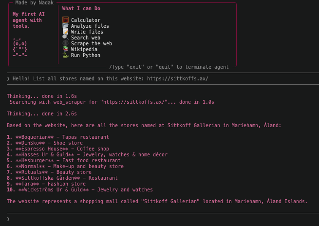

# Episode 003 — Ai Agent with Tools

> A normal AI answers from pre-trained knowledge and that is all it knows, it can take no actions. An agent with tools can actually do things: search the web, calculate, read files. It uses a goal-oriented loop like Observe → Think → Act.



## The Problem / The Question
I wanted to understand what actually makes an AI an "agent" — not just a chatbot that answers questions. I built this without a framework like LangChain so I could work through the loop, tool dispatch, and message formatting on my ownn. (Also I won´t even need langchain complexity for this small project I am building)

## What I Built
A termianl-based AI agent that uses Claude as its brain and a set of custom tools to act on. You give it a goal in plain English, and it figures out which tools to call, calls them, reads the results, and keeps going until it has a final answer. The agent runs a loop: Claude looks at the goal, decides which tool to use, gets the result back, and thinks again, until it's done.


7 tools (functions) i created:
web_search        — Searches DuckDuckGo, returns a list of results
wikipedia         — REST API, fetches a Wikipedia article summary
web_scraper       — takes a specific URL and reads the full page content, returns clean text (no html)
file_reader       — read a local file
file_writer       — write/append to a local file
code_executor     — run Python, return output
Calculator        — eval a math expression


## What I Learned
- The `code_executor` tool can be a dangerous one. I am running arbitrary Python that an LLM decided to write, so ofc in production I'd sandbox it (Docker, a subprocess with limits, etc.)
- all python built-ins command: python -c "import builtins; print(dir(builtins))"
- Unpacking. Or "dictionary unpacking." using the ** operator 
- The agent's ability to find a file depends on its current working directory. If I ask it to read or write to a file i need to give it the relative path to that cwd.
- BE SPECIFIC! with the agent if you want to write to a file, no to risk overwriting the current content. Eitehr you write (overwrite) or you append to existing content. 

### UI for a CLI tool

**Tool Use Visibility**  used `print()` statements inside `agent.py` before `run_tool()` to show which tool Claude was calling and with what input.
**Timing**  built a custom `spinner()` function that wraps any slow function, prints a status message while waiting, and shows how long it took when done.
**Visual distinction**  used the `rich` library to color the agent's response differently from user input.
**Empty lines** added `print()` between conversation turns to separate them visually.

(could use verbode (agents thought process))

## probelms I faced 
- web_search tool was pulling from chached/outdated results, so i forces a fresh quesry by appending todays date to search quesries using datetime 
- Many other problems i faced i did solve by looking up on the internet, all pages that helped me in "references" below

## How to Set Up
**Prerequisites**
- Python 3.11+
- An Anthropic API key

Install python package of choice, for this project I am experimenting with the fast package and project manager `uv`:

```bash
curl -LsSf https://astral.sh/uv/install.sh | sh
```


Create a virtual environment, activate it and install the dependencies from `requirements.txt` (everything else used is standard library math, subprocess, pathlib, json...): 

```bash
uv venv
source .venv/bin/activate
uv pip install -r requirements.txt
```

Check the installed packages
```bash
uv pip list
```

Copy the environment file and add your API keys:
```bash
cp .env.example .env
```

Run the agent:
```bash
python3 main.py
```


## Tech Used
- `uv` — Python package manager, instead of pip
- `python-dotenv` — loading API keys from `.env`
- `pydantic` — structured output validation
- `wikipedia` — Wikipedia article summaries
- `duckduckgo-search` — web search without an API key
- `beautifulsoup4` — HTML parsing for the web scraper
- `requests` — HTTP requests
- `rich` — beautiful formatting in the terminal


## References
- [uv project and package manager docs](https://docs.astral.sh/uv/getting-started/installation/)
- [beautiful soup library docs](https://pypi.org/project/beautifulsoup4/)
- [requests HTTP library docs](https://pypi.org/project/requests/)
- [rich library repo](https://github.com/Textualize/rich)
- [rich library docs](https://rich.readthedocs.io/en/latest/introduction.html)
- [eval built-in fucntion](https://docs.python.org/3/library/functions.html#eval)
- [Build a tool-using agent, Ring 2 Agentic Loop, Anthropic](https://platform.claude.com/docs/en/agents-and-tools/tool-use/build-a-tool-using-agent)
- [duckduckgo_search 8.1.1 PYPI docs](https://pypi.org/project/duckduckgo-search/)
- [subprocess](https://docs.python.org/3/library/subprocess.html)
- [stdout, stderr](https://www.geeksforgeeks.org/python/how-to-print-to-stderr-and-stdout-in-python/)
- [*args, **kwargs](https://www.w3schools.com/python/python_args_kwargs.asp)
- [time - time.time() returns the current time in seconds](https://docs.python.org/3/library/time.html#time.time)

